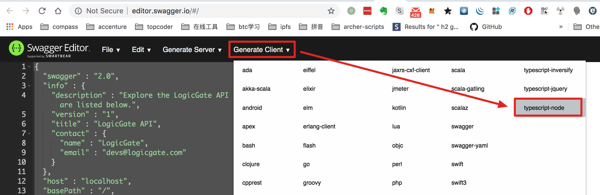

TypeScript LogicGate Api Node Client Demo
=========================================

Logicgate.com的api相当复杂，手写不太现实，好在其提供了swagger格式的文档，我们可以利用它生成typescript代码。

<https://docs.logicgate.com/#/>以swagger形式提供了api文档，可以从源代码中找到相应的swagger规范的地址为：
<https://docs.logicgate.com/swagger-spec.js>，将其最前面的`window.swaggerSpec=`去掉后，将剩下的json输入到
<http://editor.swagger.io/#/>，然后选择Generate Client中的"typescript-node":



将下载到一个zip包，其内容为`resources/typescript-node-client`下的文件，里面的`api.ts`包含了产生的typescript代码。

遗憾的是，api.ts中的代码有以下问题：

1. 编译错误：原因是一些class的“定义”处于“使用”之后
2. 缺少一些关键的api：如获取accessToken
3. （待补充）

由于api.ts非常大，修复其class定义顺序很麻烦，所以我决定将其按class拆分为多个文件，放到了`src/logicgate-api`下。
同时，在`hello.ts`中演示了如何获取accessToken以及如何使用生成的api。
（相应代码应该都可以再改进）

## 运行

先创建`src/account.json`，内容如下：

```
{
  "baseUrl": "",
  "client": "",
  "secret": ""
}
```

其中`baseUrl`形如<https://your-company.logicgate.com>，
另外数据可参考<https://help.logicgate.com/en/articles/1516843-obtaining-an-api-access-token>取得。


```
npm install
npm run demo
```
